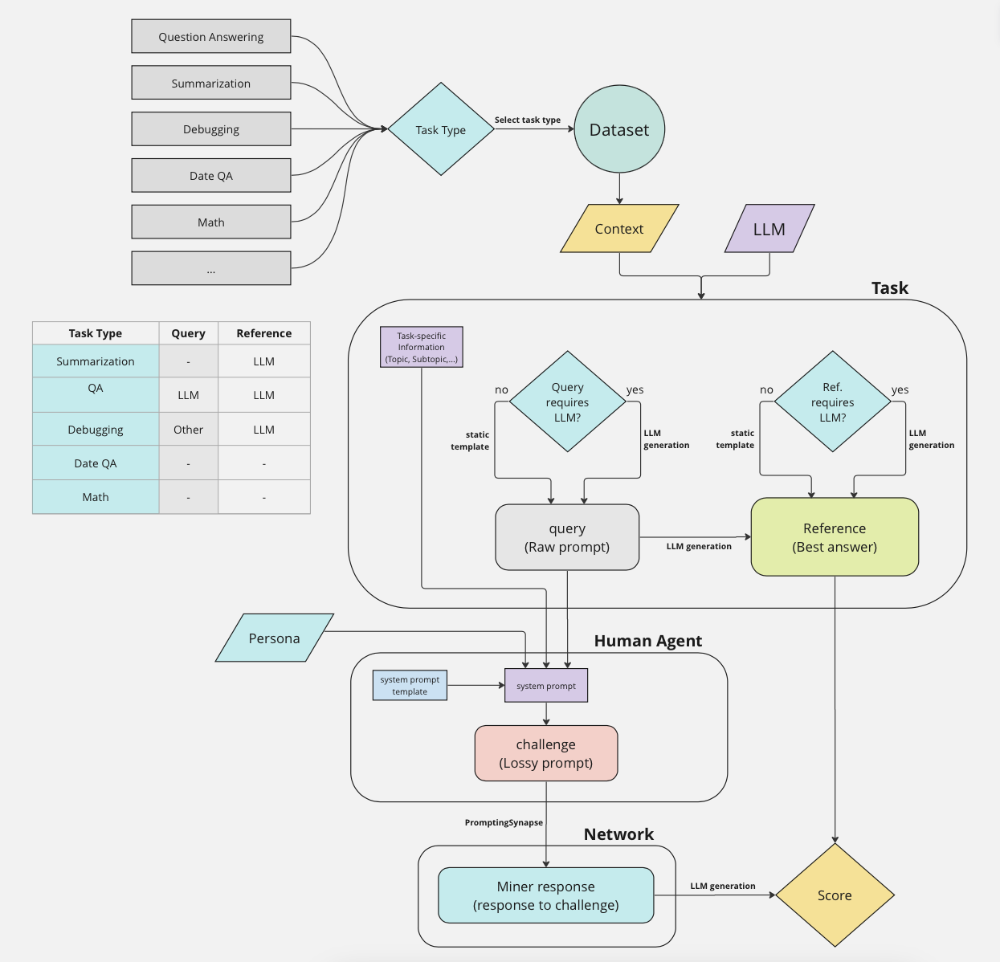

<div align="center">

# **Bittensor SN1** <!-- omit in toc -->
[](https://discord.gg/bittensor)
[](https://opensource.org/licenses/MIT) 

---

### The Incentivized Internet <!-- omit in toc -->

[Discord](https://discord.gg/bittensor) • [Network](https://taostats.io/) • [Research](https://bittensor.com/whitepaper)

</div>

---

This repository is the **official codebase for Bittensor Subnet 1 (SN1) v3.0.0+**. To learn more about the Bittensor project and the underlying mechanics, [read here.](https://docs.bittensor.com/).


This code is not yet running on mainnet but you are welcome run the incentive mechanism or test out miners on testnet (`--subtensor.network test --netuid 61`). Our estimated release date is Monday 22nd, January 2024 📆.

# Introduction

This repo defines an incentive mechanism to create a distributed conversational AI. 

Validators and miners are based on large language models (LLM). The [validation process](#validation) uses **[internet-scale datasets](#tools)** and **[goal-driven](#tasks)** behaviour to drive **[human-like conversations](#agents)**. 

</div>

# Compute Requirements

1. To run a **validator**, you will need at least 24GB of VRAM. 
2. To run the default Zephyr **miner**, you will need at least 18GB of VRAM. 

</div>

# Validation
The design of the network's incentive mechanism is based on two important requirements:

### 1. Validation should mimic human interactions

It is imperative that the validation process engages with miners in the same way as real users. The reasons for this are as follows:
- Miners will compete and continuously improve at performing the validation task(s), and so this fine tuning should be aligned with the goals of the subnet.
- It should not be possible to distinguish between validation and API client queries so that miners always serve requests (even when they do not recieve emissions for doing so).

In the context of this subnet, miners are required to be intelligent AI assistants that provide helpful and correct responses to a range of queries. 

### 2. Reward models should mimic human preferences

In our experience, we have found that it is tricky to evaluate whether miner responses are high quality. Existing methods typically rely on using LLMs to score completions given a prompt, but this is often exploited and gives rise to many adversarial strategies.

In the present version, the validator produces one or more **reference** answers which all miner responses are compared to. Those which are most similar to the reference answer will attain the highest rewards and ultimately gain the most incentive.

**We presently use a combination of string literal similarity and semantic similarity as the basis for rewarding.**

# Tools
Contexts, which are the basis of conversations, are from external APIs (which we call tools) which ensure that conversations remain grounded in factuality. Contexts are also used to obtain ground-truth answers.

Currently, the tooling stack includes:
1. Wikipedia API 
2. StackOverflow 
3. mathgenerator

More tooling will be included in future releases. 

# Tasks
The validation process supports an ever-growing number of tasks. Tasks drive agent behaviour based on specific goals, such as; 
- Question answering
- Summarization
- Code debugging
- Mathematics
 and more. 

Tasks contain a **query** (basic question/problem) and a **reference** (ideal answer), where a downstream HumanAgent creates a more nuanced version of the **query**.

# Agents

In order to mimic human interactions, validators participate in a roleplaying game where they take on the persona of **random** human users. Equipped with this persona and a task, validators prompt miners in a style and tone that is similar to humans and drive the conversation in order to reach a pre-defined goal. We refer to these prompts as **challenges**. 

Challenges are based on the query by wrapping the query in an agent persona which results in a lossy "one-way" function. This results in challenges that are overall more interesting, and less predictable.

The [diagram below](#validation-diagram) illustrates the validation flow.

#### Our approach innovatively transforms straightforward queries into complex challenges, a process akin to a 'hash function', requiring advanced NLP for resolution. This transformation is crucial for preventing simple lookups in source documents, ensuring that responses necessitate authentic analytical effort.


# Validation Diagram


# Mining

Miners are scored based on the similarity between their completions and the reference answer. Furthermore, they should utilize the same API tools as the validators in order to be able to closely reproduce the reference answer.

Miner experiments are ongoing - we will share our results on the expected performance of various miners in the coming days! 

</div>

---

# Installation
This repository requires python3.8 or higher. To install, simply clone this repository and install the requirements.
```bash
git clone https://github.com/opentensor/prompting.git
cd prompting
python -m pip install -r requirements.txt
python -m pip install -e .
```

</div>

---
# Running

Currently, the incentive mechanism and miners are a work in progress, and should only be run on the test chain. If you require test tao, please reach out to ____.

Prior to running a miner or validator, you must [create a wallet](https://github.com/opentensor/docs/blob/main/reference/btcli.md) and [register the wallet to a netuid](https://github.com/opentensor/docs/blob/main/subnetworks/registration.md). Once you have done so, you can run the miner and validator with the following commands.

The validator and base miner are based on [zephyr](https://huggingface.co/HuggingFaceH4/zephyr-7b-beta), which is a fine-tuned Mistral-7B.

**To run a validator you will need 24GB of VRAM or 18GB of VRAM for a zephyr miner**
```bash
# To run the validator
python neurons/validator.py
    --netuid 61
    --subtensor.network test
    --neuron.device cuda
    --wallet.name <your validator wallet>  # Must be created using the bittensor-cli
    --wallet.hotkey <your validator hotkey> # Must be created using the bittensor-cli
    --logging.debug # Run in debug mode, alternatively --logging.trace for trace mode

```

```bash
# To run the miner
python neurons/miners/zephyr/miner.py 
    --netuid 61
    --subtensor.network test 
    --wallet.name <your miner wallet> # Must be created using the bittensor-cli
    --wallet.hotkey <your validator hotkey> # Must be created using the bittensor-cli
    --logging.debug # Run in debug mode, alternatively --logging.trace for trace mode
```


**Running instructions for main chain are coming soon!**

</div>

---


# Real-time monitoring with wandb integration

A fresh wandb project is on its way!

## License
This repository is licensed under the MIT License.
```text
# The MIT License (MIT)
# Copyright © 2023 Yuma Rao

# Permission is hereby granted, free of charge, to any person obtaining a copy of this software and associated
# documentation files (the “Software”), to deal in the Software without restriction, including without limitation
# the rights to use, copy, modify, merge, publish, distribute, sublicense, and/or sell copies of the Software,
# and to permit persons to whom the Software is furnished to do so, subject to the following conditions:

# The above copyright notice and this permission notice shall be included in all copies or substantial portions of
# the Software.

# THE SOFTWARE IS PROVIDED “AS IS”, WITHOUT WARRANTY OF ANY KIND, EXPRESS OR IMPLIED, INCLUDING BUT NOT LIMITED TO
# THE WARRANTIES OF MERCHANTABILITY, FITNESS FOR A PARTICULAR PURPOSE AND NONINFRINGEMENT. IN NO EVENT SHALL
# THE AUTHORS OR COPYRIGHT HOLDERS BE LIABLE FOR ANY CLAIM, DAMAGES OR OTHER LIABILITY, WHETHER IN AN ACTION
# OF CONTRACT, TORT OR OTHERWISE, ARISING FROM, OUT OF OR IN CONNECTION WITH THE SOFTWARE OR THE USE OR OTHER
# DEALINGS IN THE SOFTWARE.
```
