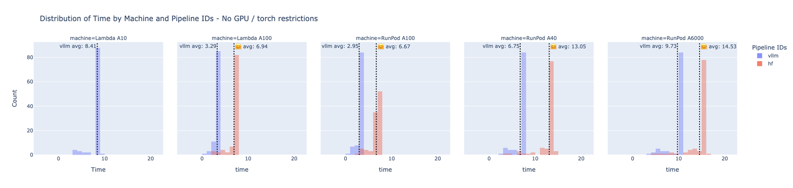
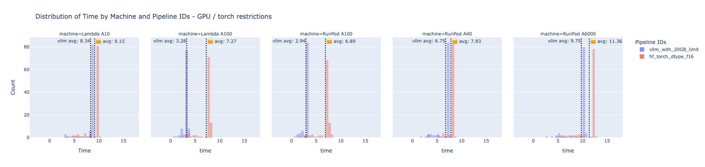

# Release Notes for prompting Version 1.2.0
## Date
[Release Date]

## What's Changed

- Adds utility scripts to facilitate environment setup by @mccrindlebrian in new setup script for generic CPU/GPU ubuntu machines #139
- Refactors validator code to facilitate support on multiple llm pipelines by @p-ferreira in #138
- Implement vllm pipeline by @p-ferreira in #138
- Adds [install.sh](../../install.sh) script to facilitate installation by @p-ferreira in #158

## TL;DR

### Results
From a practical standpoint, integrating VLLM technology leads to a significant boost in efficiency, ranging from 8.85% to 14.17% for lower-tier devices such as A10, A40, and A6000. For mid-tier devices, specifically the A100 model, the efficiency improvement is even more pronounced, with gains between 54.88% and 57.33%. This enhancement allows our validators to operate up to twice as fast when using VLLM, thereby significantly increasing the network's generation throughput.




## Known Issues and Solutions

The [VLLM framework](https://github.com/vllm-project/vllm) has rapidly gained popularity since its inception. As of March 14, 2024, despite being barely only a year old, the project has 859 open issues on GitHub. This indicates that VLLM is actively growing and has not yet reached its peak maturity.

Users of VLLM may encounter specific challenges, including dependency conflicts with other libraries such as bittensor and prompting. To mitigate these issues, **it is highly recommended to set up a new Python environment for installing the prompting v1.2.0**. This approach serves as a temporary solution to the current challenges. Should you experience any unexpected behavior with your validator following this update, **please attempt to recreate your environment before exploring the known issues listed below or seeking assistance on Discord.**

- **Issue 1 - Dependency conflicts**: 

    There are conflicting dependencies between VLLM and other required libraries:
    ```bash
    The conflict is caused by:
        prompting 1.1.2 depends on transformers==4.36.2 vllm 0.3.0 depends on transformers>=4.37.0
        bittensor 6.6.0 depends on pydantic!=1.8, !=1.8.1, <2.0.0 and >=1.7.4 vllm 0.3.0 depends on pydantic>=2.0
    ```

    The AnglE Embedding model utilized in our reward stack relies on `transformers==4.36.2`, which is incompatible with VLLM's requirement for `transformers>=4.37.0`. This specific conflict does not directly impact VLLM's functionality for our use case.

    **Solution**: 
    - Follow the [README](../../README.md#installation) instructions to recreate your environment.
    - Execute the following commands within your new Python environment:
    ```bash
    pip install pydantic==1.10.7 transformers==4.36.2
    ```

- **Issue 2: Runtime Error due to Absence of Current Event Loop**

    VLLM's dependencies include [uvloop](https://github.com/MagicStack/uvloop), which directly conflicts with bittensor.

    **Solution**:

    - Recreate your environment as per the [README](../../README.md#installation) guidelines.
    - Within your new Python environment, run:
        
        ```python
        pip uninstall uvloop
        ```
    

- **Issue 3: Manually Specifying GPU Devices for VLLM**

    VLLM currently requires manual configuration of the **`CUDA_VISIBLE_DEVICES`** environment variable to specify GPU devices:

    ```bash
    export CUDA_VISIBLE_DEVICES=1,2
    python neurons/validator.py ...
    ```

    Relevant discussions and issues:

    - [How to specify which GPU to use? vllm-project/vllm#691](https://github.com/vllm-project/vllm/discussions/691)
    - [Unable to specify GPU usage in VLLM code vllm-project/vllm#3012](https://github.com/vllm-project/vllm/issues/3012)
    - [Specifying GPU for model inference vllm-project/vllm#352](https://github.com/vllm-project/vllm/issues/352)


## Experiment Overview: Benchmarking vLLM vs. Hugging Face Pipelines:
This experiment was designed to evaluate the performance differences between the vLLM and Hugging Face (HF) pipelines across various hardware configurations. Utilizing the latest vLLM pipeline implementation found at opentensor/prompting (vLLM-test branch), our objective was to conduct a comprehensive timing benchmark.

**Dataset:**
For this comparison, we used a set of 100 random samples of QA challenges sourced from wandb. Each Language Model (LLM) processed these samples using their respective pipelines to assess their performance.

**Machines Used for Testing:**
The benchmark tests were conducted on a range of machines to capture performance across different hardware capabilities:
- Runpod A40
- Runpod A6000
- Runpod A100 SXM4 80GB
- Lambda A10
- Lambda A100 SXM4 40GB

**Testing Procedure:**
The benchmark executed the same set of QA challenges using both the Hugging Face pipeline (as currently implemented in the validator code) and the proposed vLLM validator pipeline. We aimed to compare the timing and GPU resource usage of each pipeline across the specified machines.

**GPU Footprint Analysis:**
A overall examination of the GPU footprint for each model is listed on the table below, highlighting the resource efficiency of each pipeline.:
| Machine | total_available_memory | zephyr vllm | zephyr vllm validator pipeline with 24GB gpu limitation | zephyr 🤗 hf | zephyr 🤗 hf validator pipeline  |
| --- | --- | --- | --- | --- | --- |
| Lambda A10 | 23GB | 16.25GB | 15.35GB | OOM | 15GB |
| Lambda A100 | 40.9GB | 34.58GB | 22.31GB | 31.35GB | 15.9GB |
| RunPod A40 | 46GB | 36.89 | 14.99GB | 31.4GB | 15.3GB |
| RunPod A100 | 81.92GB | 69GB | 15.45GB | 31GB | 15.3GB |
| RunPod A6000 | 49.14GB | 39.74GB | 15.41GB | 39.78GB | 15.8GB |


**Key Differences in Pipeline Configurations:**

A critical distinction between the **Zephyr 🤗 HF** and the **Zephyr 🤗 HF Validator Pipeline** is the latter's optimization for model inference and GPU usage. This optimization is achieved by leveraging **`torch_dtype_float16`**, significantly reducing the memory footprint. Notably, without this optimization, the 🤗 Zephyr model encounters Out of Memory (OOM) exceptions on the A10 hardware.

This experiment aimed to furnish a clear, comparative analysis of the vLLM and HF pipelines, with a particular focus on timing performance and GPU efficiency across a variety of computing environments.

## Results
The following analysis presents the impact of different operational configurations on the timing performance of two scenarios: with and without GPU and torch optimizations. Specifically, we compare the efficiency of the vLLM and Hugging Face (🤗 HF) pipelines under these conditions:

- **No GPU/Torch Restrictions**: This scenario involves the minimal setup configuration, where there is no constraint on **`gpu_utilization`** for vLLM and no utilization of **`torch_dtype_float16`** for 🤗 HF.
- **With GPU/Torch Restrictions**: This setup incorporates pipeline code adjustments that restrict **`gpu_utilization`** to 24GB for vLLM and employ **`torch_dtype_float16`** for 🤗 HF, mirroring the current validator implementation.

**No GPU / torch restrictions:**


| Machine | vllm_avg_in_secs | hf_avg_in_secs | % vllm_efficiency_gain |
| --- | --- | --- | --- |
| Lambda A10 | 8.41 | NaN | NaN |
| Lambda A100 | 3.29 | 6.94 | 52.59% |
| RunPod A100 | 2.95 | 6.67 | 55.77% |
| RunPod A40 | 6.75 | 13.05 | 48.28% |
| RunPod A6000 | 9.73 | 14.53 | 33.04% |

**With GPU / torch restrictions:**


| machine | vllm_with_restrictions_avg_in_secs | hf_with_restrictions_avg_in_secs | % vllm_efficiency_gain |
| --- | --- | --- | --- |
| Lambda A10 | 8.34 | 9.15 | 8.85% |
| Lambda A100 | 3.28 | 7.27 | 54.88% |
| RunPod A100 | 2.94 | 6.89 | 57.33% |
| RunPod A40 | 6.75 | 7.83 | 13.79% |
| RunPod A6000 | 9.75 | 11.36 | 14.17% |

Our findings reveal that vLLM's performance remains relatively stable, regardless of GPU restrictions, which stands in contrast to the HF pipeline. The latter demonstrates notable timing performance improvements across several hardware configurations (A40, A100s, A6000) when **`torch_dtype_float16`** is employed .

From a production standpoint, particularly when vLLM is configured with GPU restrictions aimed at maximizing usage within 20 and 24GB limits, we observed a significant variation in efficiency gains, as follows:

- **Low-End GPUs with Slow Inference (A10):** We recorded an efficiency gain of 8.85%, highlighting modest improvements in this configuration.
- **Mid-Range GPUs with Slow Inference (A40, A6000):** Efficiency gains in this category ranged from 13.79% to 14.17%, indicating noticeable enhancements in performance.
- **High-End/Mid-Range GPUs with Fast Inference (A100s):** The most substantial efficiency improvements were observed here, with gains ranging from 54.88% to 57.33%.

These results underscore the differential impacts of GPU and torch optimizations on the performance of vLLM and 🤗 HF pipelines, with significant implications for resource allocation and efficiency in production environments.


